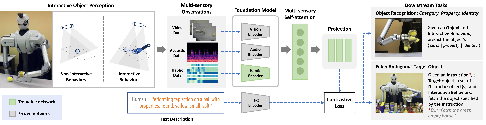
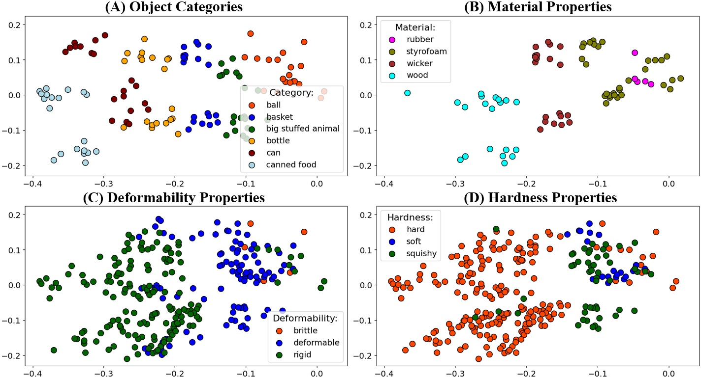
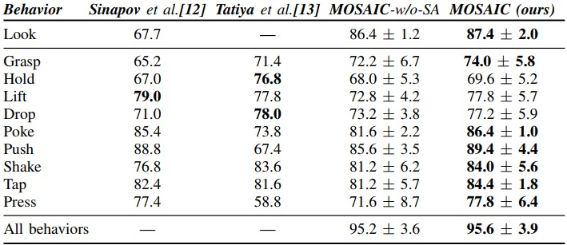
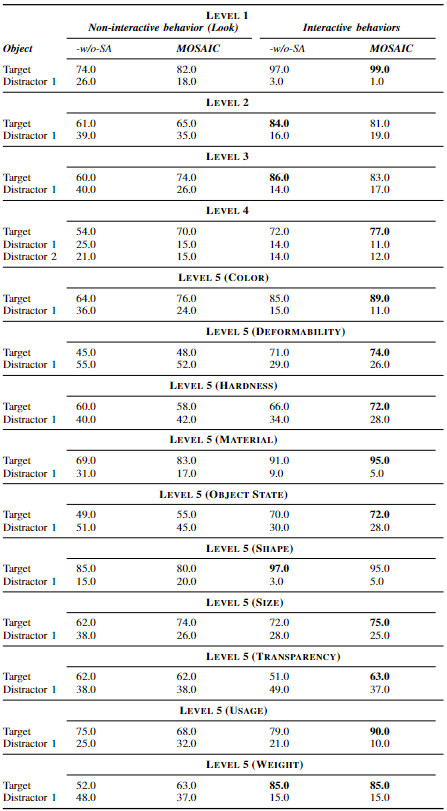

# MOSAIC: Learning Unified Multi-Sensory Object Property Representations for Robot Perception

**Abstract:**

> A holistic understanding of object properties across diverse sensory modalities (e.g., visual, audio, and haptic) is essential for tasks ranging from object categorization to complex manipulation. Drawing inspiration from cognitive science studies that emphasize the significance of multi-sensory integration in human perception, we introduce MOSAIC (Multi-modal Object property learning with Self-Attention and Integrated Comprehension), a novel framework designed to facilitate the learning of unified multi-sensory object property representations. While it is undeniable that visual information plays a prominent role, we acknowledge that many fundamental object properties extend beyond the visual domain to encompass attributes like texture, mass distribution, or sounds, which significantly influence how we interact with objects. In MOSAIC, we leverage this profound insight by distilling knowledge from the extensive pre-trained Contrastive Language-Image Pre-training (CLIP) model, aligning these representations not only across vision but also haptic and auditory sensory modalities. Through extensive experiments on a dataset where a humanoid robot interacts with 100 objects across 10 exploratory behaviors, we demonstrate the versatility of MOSAIC in two task families: object categorization and object-fetching tasks. Our results underscore the efficacy of MOSAIC's unified representations, showing competitive performance in category recognition through a simple linear probe setup and excelling in the fetch object task under zero-shot transfer conditions. This work pioneers the application of CLIP-based sensory grounding in robotics, promising a significant leap in multi-sensory perception capabilities for autonomous systems. We have released the code, datasets, and additional results: https://github.com/gtatiya/MOSAIC.



## Installation

`Python 3.10` is used for development.

```
git clone https://github.com/gtatiya/MOSAIC.git
cd MOSAIC
pip install -e .
```

## Download

- Dataset: `./download/dataset.sh`
- Dataset details can be found on the [dataset webpage](https://www.eecs.tufts.edu/~gtatiya/pages/2014/CY101Dataset.html).

## How to run the code?

### Train MOSAIC

- MOSAIC without Self-Attention: `python learn/unify_repr.py -setting setting1`
- MOSAIC with Self-Attention: `python learn/unify_repr.py -setting setting2`

### Evaluation Tasks

#### Object Category Recognition
- MOSAIC without Self-Attention: `python learn/unify_repr_tasks.py -task classify_category -setting setting1`
- MOSAIC with Self-Attention: `python learn/unify_repr_tasks.py -task classify_category -setting setting2`

#### Fetch Object
- MOSAIC without Self-Attention: `python learn/unify_repr_tasks.py -task fetch_object_task -setting setting1`
- MOSAIC with Self-Attention: `python learn/unify_repr_tasks.py -task fetch_object_task -setting setting2`

## Results

### Illustrative Example



### Object Category Recognition Results



### Fetch Object Results


